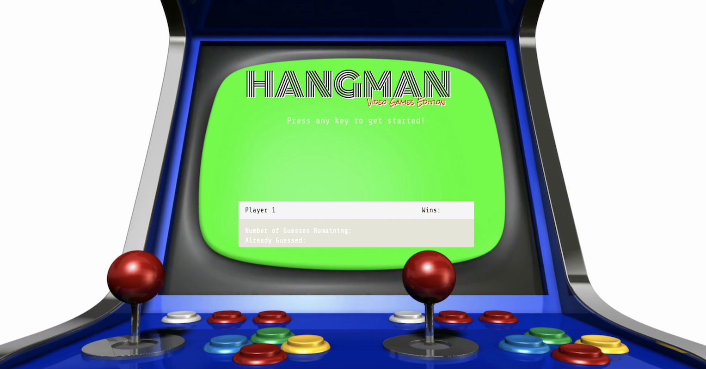

# Hangman-Game



## What Is It?
A video game themed Hangman game.  The object of the game is to guess the name of popular video game characters.

## How Do I Play?
You will have 15 attempts to try an guess a randomly generated video game character.

## How Do I Get In On This?
1. The game is hosted on GitHub Pages.  Click [HERE](https://xtiane.github.io/Hangman-Game/) to start playing!
2. You can clone this repository to your local environment and then launch the index.html page on your browser.

## Under the Hood
This game was created using HTML/CSS/Javascript.  The first version of the game uses an Array object to hold the name of the characters which the user has to guess ```assets/javascript/game.js```.  Version two, uses a JSON object ```assets/javascript/game-v2.js```
